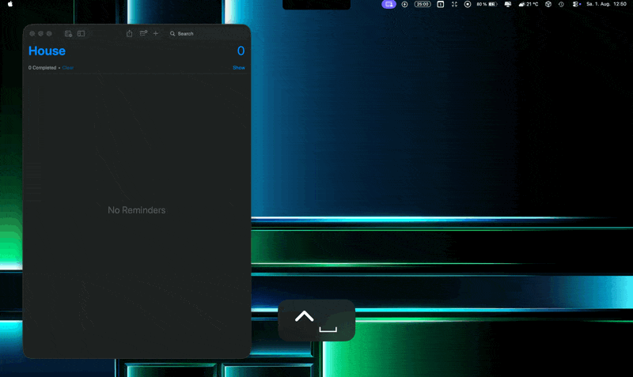

# ⚡ LightningTask

**Quick-entry macOS app for Reminders with AI-powered suggestions**

LightningTask provides a floating panel accessible via global hotkey (⌃Space) to quickly create reminders. Powered by Foundation Models (Apple Intelligence), it automatically suggests the best reminder list, extracts dates/times, and handles multiple tasks at once.



## ✨ Features

- **🎯 Global Hotkey Access**: Press ⌃Space from anywhere to open the quick-entry panel
- **🤖 AI-Powered Suggestions**: Automatically categorizes tasks and extracts due dates/times
- **📋 Smart List Detection**: Recognizes list names in your input ("Add milk to Shopping List")
- **⏰ Date & Time Parsing**: Understands natural language ("tomorrow at 9am", "Friday afternoon")
- **🔔 Optional Reminders**: Toggle notification alarms on/off
- **✅ Multiple Tasks**: Create several reminders at once ("Buy milk, eggs, and bread")
- **🎨 Native macOS Design**: Uses system materials and follows platform conventions

## 🏗️ Architecture

LightningTask follows a clean, modular architecture:

```
LightningTask/
├── App/                          # App entry point
├── Core/
│   ├── Models/                   # Data models (TaskSuggestion)
│   ├── Services/                 # Business logic layer
│   │   ├── ReminderService.swift # EventKit integration
│   │   └── AIService.swift       # Foundation Models integration
│   └── Utilities/                # Utility extensions
├── Features/
│   └── QuickEntry/               # Main feature
│       ├── ViewModels/           # ReminderViewModel
│       ├── Views/                # SwiftUI views
│       └── Controllers/          # NSPanel management
└── Tests/
```

### Key Components

#### **Services Layer**
- **`ReminderService`**: Handles all EventKit operations (authorization, list management, reminder creation)
- **`AIService`**: Generates task suggestions using Foundation Models with structured output

#### **ViewModel**
- **`ReminderViewModel`**: Coordinates between UI, services, and manages form state
- Observes user input and triggers debounced AI suggestions
- Handles saving reminders and state resets

#### **Views**
- **`LightningTaskPanelView`**: Main SwiftUI interface with text field and suggestion chips
- **`ChipView`**: Reusable chip component for lists and dates
- **`AlarmButton`**: Toggle for notification alarms

#### **Utilities**
- **`StringUtilities.swift`**: Token matching, Levenshtein distance, list name detection

## 🛠️ Technologies

- **Swift 6.2** & **SwiftUI**
- **EventKit** for Reminders integration
- **Foundation Models** (Apple Intelligence) for AI suggestions
- **AppKit** for global hotkey and floating panel
- **Sparkle** for automatic updates — integrated and locally testable via `build_and_update.sh`; prepared for production release with Developer ID signing

## 🚀 Getting Started

### Prerequisites

- macOS 26.0 or later
- Xcode 26.0 or later
- Apple Intelligence enabled (for AI features)

### Building

1. Clone the repository:
```bash
git clone https://github.com/MLT-17/LightningTask.git
cd LightningTask
```

2. Open `LightningTask.xcodeproj` in Xcode

3. Build and run (⌘R)

### First Launch

1. Grant Reminders access when prompted
2. The app runs in the menu bar (⚡ icon)
3. Press ⌃Space to open the quick-entry panel
4. Right-click the menu bar icon for settings

> **Note:** The app is not notarized (no Apple Developer account). On first launch,
> macOS may block it. To open: right-click the app → **Open** → **Open** again.

## 📖 Usage

### Basic Usage

1. Press **⌃Space** to open LightningTask
2. Type your task: "Buy groceries tomorrow at 5pm"
3. LightningTask suggests:
   - List: "Shopping" (or similar)
   - Date: Tomorrow at 17:00
   - Creates alarm by default
4. Press **Return** to save and close
5. Press **⌘Return** to save and create another task

### Advanced Features

- **Multiple tasks**: "Buy milk, eggs, and bread" → creates 3 separate reminders
- **Explicit list**: "Meeting in Work tomorrow" → forces "Work" list
- **Date-only**: "Call mom Friday" → creates reminder on Friday without specific time
- **Time-only**: "Meeting at 3pm" → creates reminder today at 15:00

## 🧪 Testing

```bash
# Run unit tests
xcodebuild test -scheme LightningTask

# Or in Xcode
⌘U
```

### Testing Sparkle Updates Locally

`build_and_update.sh` builds a release, signs the appcast, and serves it on
`localhost:8000` so you can test the full update flow without a Developer ID certificate.

**Requirement:** `generate_appcast` from the Sparkle Homebrew cask:
```bash
brew install --cask sparkle
```

**Steps:**
1. Make sure a previous version of the app is already running (the one that will *receive* the update)
2. Run the script — it bumps the build number, builds a new release, and starts the server:
```bash
chmod +x build_and_update.sh   # first time only
./build_and_update.sh
```
3. In the running app: right-click the menu bar icon → **Check for Updates…**
4. Press **Ctrl+C** to stop the server when done

## 🗺️ Roadmap

**✅ Shipped**
- Menu bar app with global hotkey + Spotlight-style floating panel
- Reminders/EventKit integration — create, multi-task input, race-condition-safe saving
- On-device AI (Apple Foundation Models): list suggestion, date/time parsing, alarm handling
- Auto-update infrastructure (Sparkle), local signed build pipeline

**🔨 Up next**
- Editable item chips — correct or remove extracted tasks before saving
- Settings panel (default list, configurable hotkey)
- Developer ID signing & notarization — enables Sparkle production updates and removes Gatekeeper friction
- GitHub Actions release workflow — automated build, sign, and publish on version tag

**📋 Planned**
- Voice input (Speech framework)
- Remaining polish (drag handle, menu bar status icon, animations, accessibility)
- More languages — currently English and German; open to contributions
- iOS target (shared ViewModel/business logic, widget)
- watchOS target (complications, Siri voice capture)

## 🤝 Contributing

Contributions are welcome! Please feel free to submit a Pull Request.

### Development Guidelines

1. Follow Swift API Design Guidelines
2. Keep services focused and single-responsibility
3. Add tests for new features
4. Document public APIs with DocC-style comments
5. Use structured concurrency (async/await) over legacy patterns

## 📄 License

MIT

## 🙏 Acknowledgments

- Built with Swift and SwiftUI
- Powered by Apple Intelligence (Foundation Models)
- Uses [Sparkle](https://sparkle-project.org/) for updates
---

**Note**: Apple Intelligence features require macOS 26.0 or later and may not be available in all regions.
